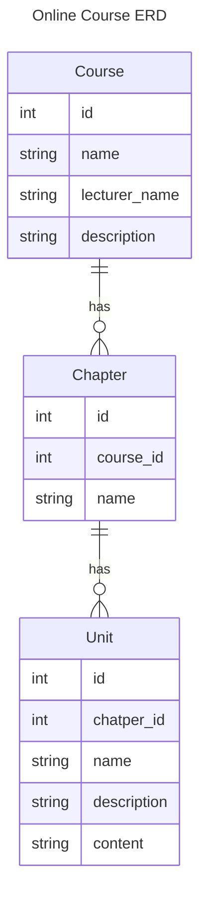

# online_course

This project's root dir and rails service root dir are not the same. You should cd to online_course(the inner one) to
start rails server.

## how to start

## ERD



## DB

- development env

```bash
I try to develop using postgres run on docker container.

```bash
docker run --name online_course_development -d -p 5432:5432 -v ./postgres_data:/var/lib/postgresql/data -e POSTGRES_DB=online_course_development -e POSTGRES_USER=online_course_user -e POSTGRES_PASSWORD=online_course_password postgres
```

- test env
```
docker run --name online_course_test -d -p 5433:5432 -e POSTGRES_DB=online_course_test -e POSTGRES_USER=online_course_user -e POSTGRES_PASSWORD=online_course_password postgres
DISABLE_SPRING=true rails db:migrate RAILS_ENV=test
```

## Gems

- annotated: for model documentation

```bash
annotate --models
```

- pry & pry-byebug: for debug and navigation
- activerecord-import: avoid N+1 query when doing association insert

## Issues

- apple silicon issue

I get this error when I try to run `rails c`

```
Running via Spring preloader in process 79343
Loading development environment (Rails 6.1.7.8)
irb(main):001:0>  Course.connection
objc[79343]: +[__NSCFConstantString initialize] may have been in progress in another thread when fork() was called.
objc[79343]: +[__NSCFConstantString initialize] may have been in progress in another thread when fork() was called. We cannot safely call it or ignore it in the fork() child process. Crashing instead. Set a breakpoint on objc_initializeAfterForkError to debug.
```

ref: https://stackoverflow.com/questions/52671926/rails-may-have-been-in-progress-in-another-thread-when-fork-was-called
try use

```bash
DISABLE_SPRING=true rails c
or just
spring stop
```

- delete dependent: :destroy N+1 query: use destroy_all and foreign_key on_delete cascade
