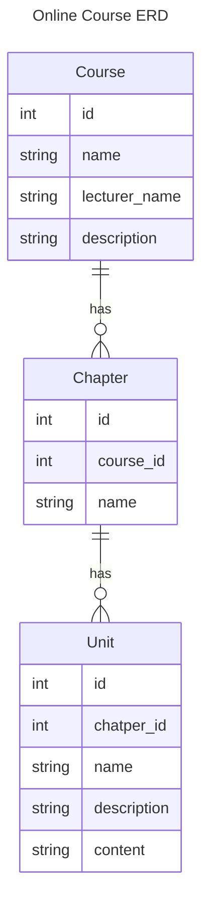

# online_course

This project's root dir and rails service root dir are not the same. You should cd to online_course(the inner one) to
start rails server.

## how to start
```bash
# db
docker run --name online_course_development -d -p 5432:5432 -v ./postgres_data:/var/lib/postgresql/data -e POSTGRES_DB=online_course_development -e POSTGRES_USER=online_course_user -e POSTGRES_PASSWORD=online_course_password postgres
# rails
cd online_course
bundle install
rails db:migrate
rails s
```

## usage

- get all courses
  ```bash
  curl --location 'localhost:3000/api/v1/courses'
  ```

  - show course by id
    ```
    curl --location 'localhost:3000/api/v1/courses/48'
    ```

    - create course
      - create just a course
        ```
        curl --location 'localhost:3000/api/v1/courses' \
        --header 'Content-Type: application/json' \
        --data '{
          "course": {
            "name": "my_new_course",
            "lecturer_name": "my_lecturer_name"
          }
        }'
        ```
      - create course with chapters
        - put chapters_attributes in order, ordering will be automatically assigned
        ```
        curl --location 'localhost:3000/api/v1/courses' \
        --header 'Content-Type: application/json' \
        --data '{
          "course": {
            "name": "my_new_course",
            "lecturer_name": "my_lecturer_name",
            "chapters_attributes": [
              {
                "name": "Chapter 1"
              },
              {
                "name": "Chapter 2"
              }
            ]
          }
        }'
        ```
      - create course with chapters and units
        - like chapters_attributes, units_attributes should be in order
        
        ```
        curl --location 'localhost:3000/api/v1/courses' \
        --header 'Content-Type: application/json' \
        --data '{
          "course": {
            "name": "my_new_course",
            "lecturer_name": "my_lecturer_name",
            "chapters_attributes": [
              {
                "name": "Chapter 1",
                "units_attributes": [
                  {
                    "name": "unit 1-1",
                    "content": "unit 1-1 content"
                  },
                  {
                    "name": "unit 1-2",
                    "content": "unit 1-2 content"
                  }
                ]
              },
              {
                "name": "Chapter 2",
                "units_attributes": [
                  {
                    "name": "unit 2-1",
                    "content": "unit 2-1 content"
                  },
                  {
                    "name": "unit 2-2",
                    "content": "unit 2-2 content"
                  },
                  {
                    "name": "unit 2-3",
                    "content": "unit 2-3 content"
                  }
                ]
              }
            ]
          }
        }'
        ```
        - update course
          - it follows PATCH semantics, so you can update only the fields you want
          - if it's the relation field, you can update it by using _attributes
          - if you want to delete the relation, put it as a empty array
          - if you want to update the relation, put the new data in the array with the same id
          - if you want to add new relation, put the new data in the array without id
          ```
            curl --location --request PATCH 'localhost:3000/api/v1/courses/52' \
            --header 'Content-Type: application/json' \
            --data '{
              "course": {
                "chapters_attributes": [
                  {
                    "id": 57,
                    "units_attributes": [
                      {
                        "id": 119,
                        "content": "unit 1-1 updated"
                      },
                      {
                        "name": "unit 1-3",
                        "content": "new unit 1-3 content"
                      }
                    
                    ]
                  },
                  {
                    "id": 58 
                  }
                ]
              }
            }'
          ```
  

## ERD



## DB

- development env
    ```bash
    I try to develop using postgres run on docker container.
    
    ```bash
    docker run --name online_course_development -d -p 5432:5432 -v ./postgres_data:/var/lib/postgresql/data -e POSTGRES_DB=online_course_development -e POSTGRES_USER=online_course_user -e POSTGRES_PASSWORD=online_course_password postgres
    ```

- test env
    ```
    docker run --name online_course_test -d -p 5433:5432 -e POSTGRES_DB=online_course_test -e POSTGRES_USER=online_course_user -e POSTGRES_PASSWORD=online_course_password postgres
    DISABLE_SPRING=true rails db:migrate RAILS_ENV=test
    ```

## Gems

- annotated: for model documentation, do `annotate --models`
- pry & pry-byebug: for debug and navigation
- activerecord-import: avoid N+1 query when doing association insert
- faker: generate fake data
- factory_bot_rails: generate fake data for test
- simplecov: code coverage, when run rspec, it will generate coverage report in public/coverage dir

## Issues

- apple silicon issue

I get this error when I try to run `rails c`

```
Running via Spring preloader in process 79343
Loading development environment (Rails 6.1.7.8)
irb(main):001:0>  Course.connection
objc[79343]: +[__NSCFConstantString initialize] may have been in progress in another thread when fork() was called.
objc[79343]: +[__NSCFConstantString initialize] may have been in progress in another thread when fork() was called. We cannot safely call it or ignore it in the fork() child process. Crashing instead. Set a breakpoint on objc_initializeAfterForkError to debug.
```

ref: https://stackoverflow.com/questions/52671926/rails-may-have-been-in-progress-in-another-thread-when-fork-was-called
try use

```bash
DISABLE_SPRING=true rails c
or just
spring stop
```

- delete dependent: :destroy N+1 query: use destroy_all and foreign_key on_delete cascade
